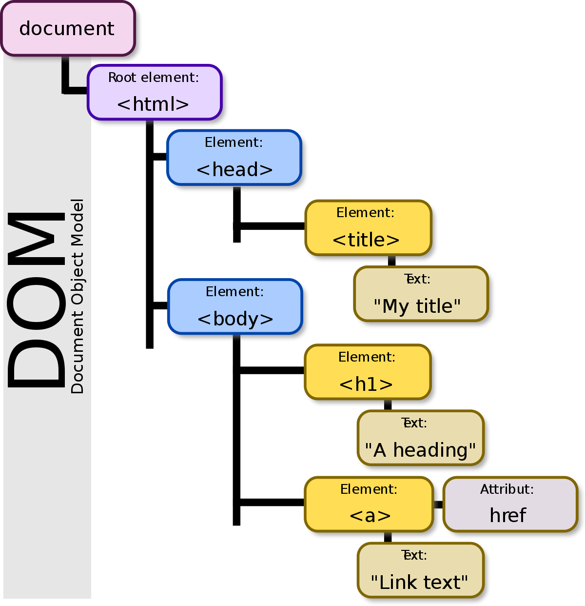

# Job-Posting-Big-Data

## Prerequisites

Before you begin, ensure you have met the following requirements:
<!--- These are just example requirements. Add, duplicate or remove as required --->
* You have installed the latest version of [cdx-toolkit](https://github.com/cocrawler/cdx_toolkit)
* You have a `<Windows/Linux/Mac>` machine. 
* You have read a list of links about how to download and manipuate common crawl data as follows:

  - [ccmain starts](https://commoncrawl.org/the-data/get-started/)

  - [ccmain index](https://index.commoncrawl.org/)

  - [ccmain projs](http://commoncrawl.org/the-data/examples/)

  - [ccmain warcs](https://commoncrawl.org/2018/03/index-to-warc-files-and-urls-in-columnar-format/)

  - [search 2021.01](https://index.commoncrawl.org/CC-MAIN-2021-04)

## Web Scraping and Beautiful Soup

Web pages can be represented by the objects that comprise their structure and content. This representation is known as the Document Object Model.  The purpose of the DOM is to provide an interface for programs to change the structure, style, and content of web pages. The DOM represents the document as nodes and objects. Amongst other things, this allows programming languages to interactively change the page and HTML!

Beautiful Soup is a Python library designed for quick scraping projects. It allows us to select and navigate the tree-like structure of HTML documents, searching for particular tags, attributes or ids. It also allows us to then further traverse the HTML documents through relations like children or siblings. In other words, with Beautiful Soup, we could first select a specific div tag and then search through all of its nested tags. With the help of Beautiful Soup, we can:

* Navigate HTML documents using Beautiful Soup's children and sibling relations
* Select specific elements from HTML using Beautiful Soup
* Use regular expressions to extract items with a certain pattern within Beautiful Soup
* Determine the pagination scheme of a website and scrape multiple pages
* Identify and scrape images from a web page
* Save images from the web as well as display them in a Pandas DataFrame for easy perusal

## Questions:

### 1/ Tech ads proportional to population (selected)
Q: Where do we see relatively fewer tech ads proportional to population?

### 2/ Largest job seekers
Q: What are the three companies posting the most tech job ads?

### 3/ Percent of relatively infrequent job seekers (selected)
Q: What percent of tech job posters post no more than three job ads a month?

### 4/ Job posting Spikes
Q: Is there a significant spike in tech job postings at the end of business quarters?

Q: If so, which quarter spikes the most?

### 5/ Tech job posting trend
Q: Is there a general trend in tech job postings over the past year?

Q: What about the past month?

### 6/ Entry Level Experience
Q: What percentage of entry level jobs require previous experience?

### 7/ Qualifications and Certifications
Q: What are the top three qualifications or certifications requested by employers?

### 8/ Low Code/No Code [Ref.](https://en.wikipedia.org/wiki/Low-code_development_platform)
Q: What percentage of Tech Job Listings require experience in a Low Code or No Code solution? 

